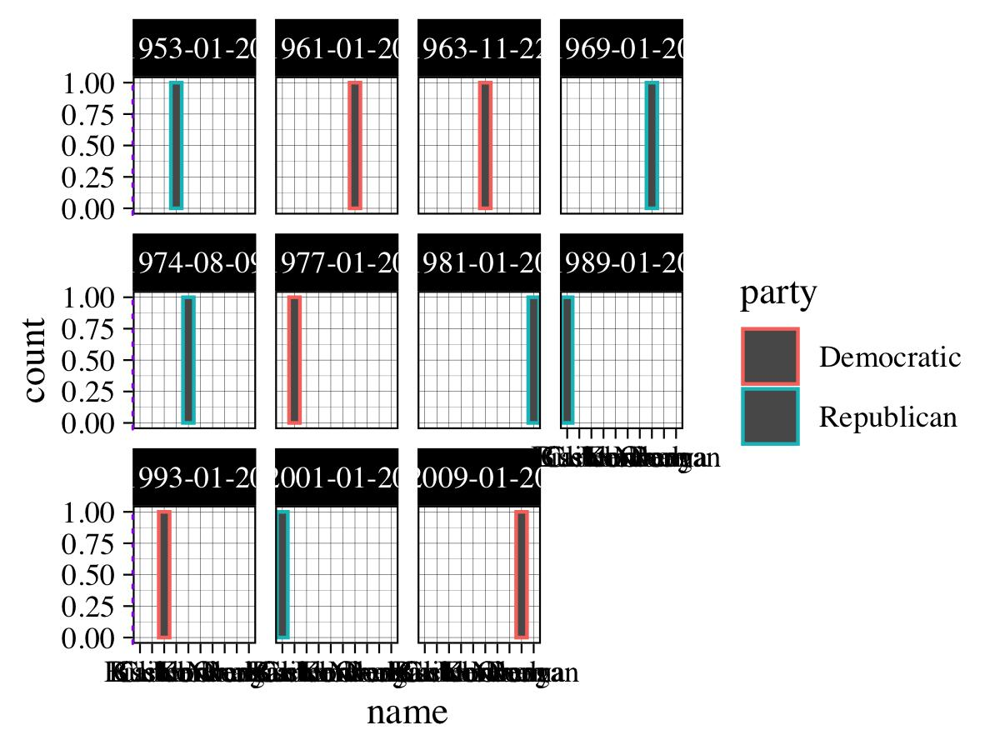

```{r, include = FALSE}
knitr::opts_chunk$set(message = FALSE,
                      dpi = 300, 
                      out.height = "300px", 
                      out.width = "300px")
```

```{r xaringan-themer, include = FALSE}
library(xaringanthemer)
mono_light(
  base_color = "#1c5253",
  header_font_google = google_font("Josefin Sans"),
  text_font_google   = google_font("Montserrat", "300", "300i"),
  code_font_google   = google_font("Droid Mono"),
  header_h1_font_size = "40px",
  header_h2_font_size = "30px",
  header_h3_font_size = "20px", 
  text_font_size = "20px",
  code_font_size = "15px"
)
```

```{r setup, echo=FALSE, warning=FALSE}
library(tidyverse)
```


# Catch up

So far we learned:

* about data types and structures;
* how to write functions;
* about the logic and the flow;
* how to create visualisations.

```{r, out.width = 330, out.height = 240, echo = FALSE}

```


.footnote[[More obnoxious plots here](https://twitter.com/biogeobiochem/status/1172547837046820864)]

---
# Pipes

And we've touched on dplyr syntax.

Now we know what are pipies and that instead of this:

```{r, eval = FALSE}
leave_house(get_dressed(get_out_of_bed(wake_up(me))))
```

or better yet this:
```{r, eval = FALSE}
woken_up_me <- wake_up(me)
standing_up_me <- get_out_of_bed(woken_up_me)
dressed_me <- get_dressed(standing_up_me)
ready_me <- leave_house(dressed_me)
```

We can write it like this:

```{r, eval = FALSE}
me %>%
  wake_up() %>%
  get_out_of_bed() %>%
  get_dressed() %>%
  leave_house()
```

.footnote[Source: [Andrew Heiss](https://twitter.com/andrewheiss/status/1173743447171354624)]

---

# Plan for today

* `lapply`, `apply`, ...
* more `tidyverse`

yay!

---

# Better looping

`lapply`, `apply`, `sapply` and so on, are here to help us write more efficient loops in a more readible way.

But before we start, quick reminder. Given the following matrix:

```{r}
set.seed(7)
mat <- matrix(rnorm(1000), 10, 10)
rownames(mat) <- paste0("gene_", 1:nrow(mat))
colnames(mat) <- paste0("sample_", 1:ncol(mat))
```

get the following:

* `sums_row`, `sum_cols`- sum the rows and columns of the matrix
* `normalized_row` - from each value in the row substract the row' mean and divide the result of substracyion by row' standar deviation

---

* `sums_row`
```{r}
sums_row <- c()
# your code here
```

* `sums_col`
```{r}
sums_col <- c()
# your code here
```

* `normalized_row`
```{r}
normalized_row <- mat
# your code here
```
---

* `sums_row`
```{r}
sums_row <- c()
for (i in 1:nrow(mat)) {
   sums_row <- c(sums_row, sum(mat[i, ]))
}
sums_row
```

* `sums_col`
```{r}
sums_col <- c()
for (i in 1:ncol(mat)) {
   sums_col <- c(sums_col, sum(mat[, i]))
}
sums_col
```

---

* `normalized_row`
```{r}
normalized_row <- mat
for (i in 1:nrow(mat)) {
  norm_row <- (mat[i, ] - mean(mat[i, ])) / sd(mat[i,])
  normalized_row[i, ] <- norm_row
}
normalized_row[1:3, ]
```

* `normalized_row`
```{r}
normalized_row <- scale(mat)
normalized_row
```
---

# `apply`
Now, let's look how exactly the same thing we can do using `apply`

`apply(array, margin, fun, ...)`

* `array` - array on which we will perform the operation
* `margin` - `1` - perform operation rowwise, `2` - columnwise and `c(1,2)` - both, row and columnwise
* `fun` - function to apply to each row/column

---

* `sums_row`
```{r}
sums_row <- c()
for (i in 1:nrow(mat)) {
   sums_row <- c(sums_row, sum(mat[i, ]))
}
sums_row
```

or

```{r}
sums_row_apply <- apply(mat, 1, sum)
```

```{r}
all(sums_row == sums_row_apply)
```

---

* `sums_col`
```{r, eval = FALSE}
sums_col_apply <- apply()
```

---

* `sums_col`
```{r}
sums_col_apply <- apply(mat, 2, sum)
```

---
We can also define more complex functions:

* `normalized_row`
```{r}
normalized_row_apply <- apply(mat, 1, function(row) (row - mean(row)) / sd(row))
```

```{r}
all(normalized_row_apply == normalized_row)
```

---

# `lapply`

`lapply(x, fun, ...)`

* `x` - a list over which it will iterate
* `fun` - function to be applied to each item in the list

```{r}
list_in <- list(test = 1:10, train = 10:20, teach = 20:30)
out <- lapply(list_in, median)
out
```

---
# `lapply` vs. `sapply`
```{r}
lout <- lapply(colnames(mat), function(colname) {
 median(mat[, colname])
})

head(lout, n = 3)
```

```{r}
sout <- sapply(colnames(mat), function(colname) {
 median(mat[, colname])
})
sout
```

---
# Others

* `vapply(x, fun, fun.value)` - perform an operation on each element in the vector

```{r}
vapply(1:ncol(mat), function(i) sd(mat[,i]), c(1))
```

* `tapply(vector, index, function)`

```{r}
n <- 17 
fac <- factor(rep_len(1:3, n), levels = 1:5)
table(fac)
tapply(1:n, fac, sum)
```
---
# Others

* `mapply(fun, MoreArgs)`

```{r}
mapply(rep, times = 1:4, MoreArgs = list(x = 42))
```

---

# More tidyverse

```{r}
library(tidyverse)
data(starwars)
starwars
```


